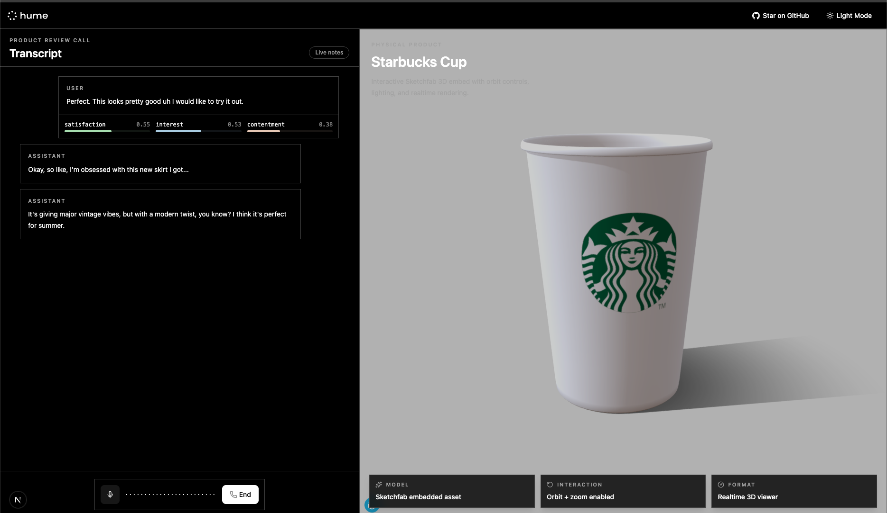

<div align="center">
  
  <h1>Product Annotator</h1>
</div>



## Overview

This project lets everyone create product review configurations to be sent out as a link to an end consumer. When opened a link users can talk to an agent about how they feel about 3d version of the product. These feedback are then persisted and sent to clickhouse db with the correct annotation. 

## Running locally 

Want to try it out, follow the steps below:

1. Set up your API key and Secret key:

   In order to make an authenticated connection we will first need to generate an access token. Doing so will require your API key and Secret key. These keys can be obtained by logging into the Hume AI Platform and visiting the [API keys page](https://app.hume.ai/keys). For detailed instructions, see our documentation on [getting your api keys](https://dev.hume.ai/docs/introduction/api-key).

   Place your `HUME_API_KEY` and `HUME_SECRET_KEY` in a `.env` file at the root of your project.

   ```shell
   echo "HUME_API_KEY=your_api_key_here" > .env
   echo "HUME_SECRET_KEY=your_secret_key_here" >> .env
   ```

   You can copy the `.env.example` file to use as a template.

2. Run the project:
   ```shell
   npm run dev
   ```
